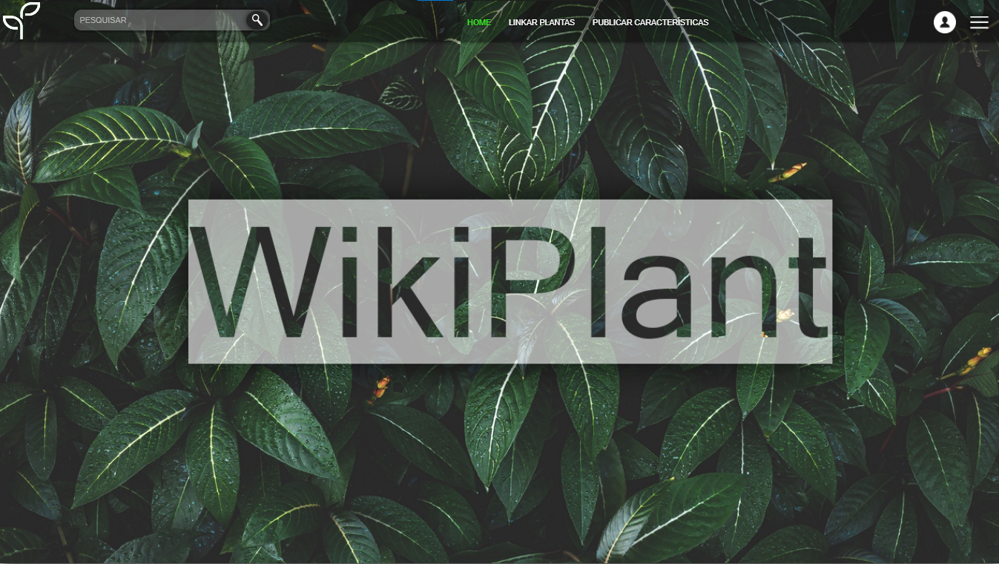

# wikiplant

## Sistema de informações e ajuda sobre cultivo de plantas

### Descrição

Um dos meus primeiros contatos com a programação,Wikiplant foi um projeto que desenvolvi com mais quatro amigos do meu curso técnico, o objetivo era criar um site onde se pudesse obter informações sobre o cuidado de plantas, e futuramente, utilizando um raspberry pi implantado nas plantas, colher informações como temperatura, umidade e gerar um log sobre a qualidade da planta em geral, e a saúde dela.

Embora o projeto tenha sido descontinuado, serviu como uma porta de entrada para a área de desenvolvimento e prática de código para todos nós, tendo contato com o back-end feito em php e MySql, e o front-end com JavaScript
